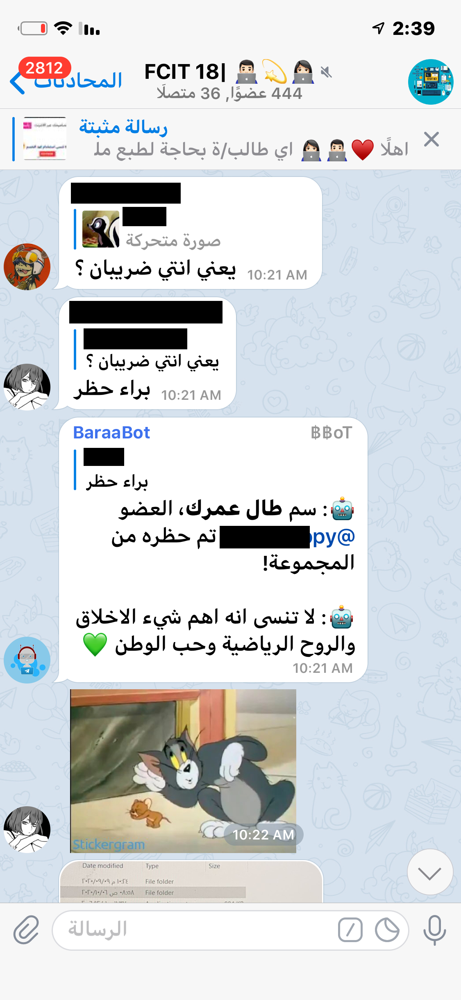
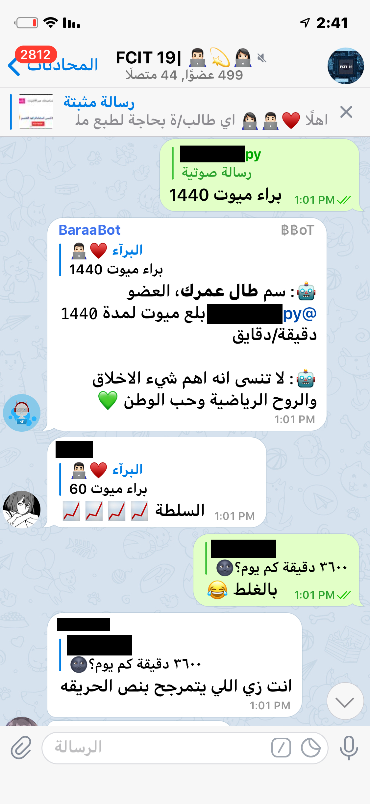
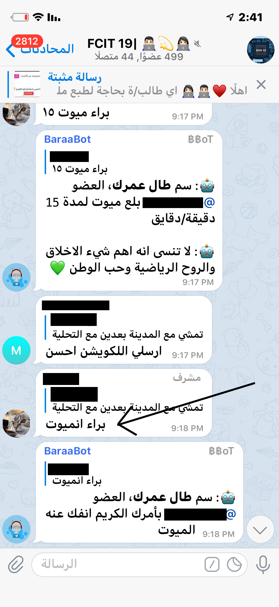

# BaraaBot Documentation
BaraaBot is a telegram bot that acts as a personal assistant
## About
BaraaBot was created using Pythonic ways 😉, and it is in its first phases of development, Hope it will provide a lot of educational benefits plus other joyable benefits too.
## Updates
updates can contain several different things such as fixing bugs along with what will be mentioned in the update
### Pilot, BaraaBot version 1.0.0
First version of the bot, contains 9 Commands plus other features:
- `/start` command: Gives an introduction about BaraaBot.
- `/about` command: Gives information about the bot and its current version plus the developer contact info.
- `براء حظر` command: Used in groups ONLY, as an administrator, mention someone's text with this command and they will be kicked/banned from the group chat.
- `براء ميوت` command: Used in groups ONLY, as an administrator, mention someone's text with this mute command and the number of minutes to be muted and they will be muted for that specific duration, mute range (1 till 4320) minutes, which is 3 Days.
- `براء انميوت` command: Used in groups ONLY, as an administrator:
  1. write "**@someone براء انميوت**" and they will be unmuted using their usernames.
  2. mention someone's text with this unmute command they will be unmuted (in-case this user has no username >> @someone), or just unmute them yourself.
- `براء هات` command: acts as a resource getter for your specification.
- `براء حول` command: alters users messages into (bold, italic, code-shape).
- `براء قلد` command: this is a very creative command cause it makes the bot copy your messages (which you want the bot to say) and simultaneously deletes your messages, as i have noticed people use "قول" command to make the bot say things and then they delete their messages so i had to come up with something that takes things off your shoulder.
- `لا تقلد` command: this command stops the bot from copying you.
-----
Features:
- any messages sent from important channels, will be forwarded to all groups that the bot is in.
----
examples:
----

<code>/start</code> Command

